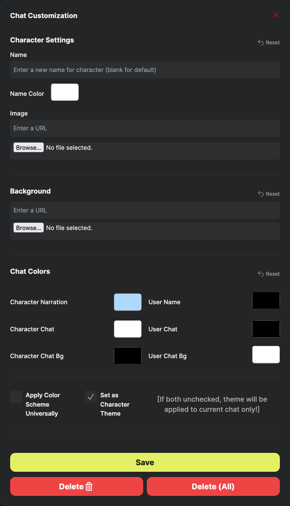
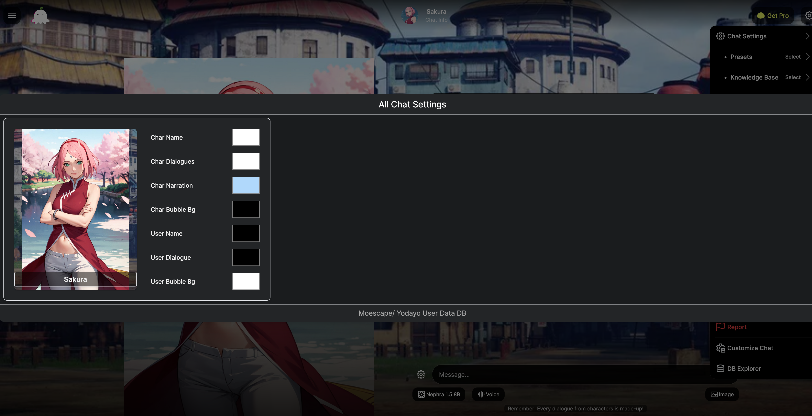

# Yodayo/Moescape-Chat-Customizer

Customize Moescape/Yodayo Tavern chat to your liking with enhanced performance and modern features.

## Overview
Yodayo Chat Customizer is a userscript that allows you to fully customize the appearance and behavior of the Yodayo chat interface. This project has been recently updated with significant performance improvements, better error handling, and enhanced user experience.

## Features
- **Enhanced Performance**: Optimized CSS injection and caching for smoother operation
- **Smart Color Management**: Per-character themes with universal color fallbacks
- **Advanced Image Handling**: Support for both URLs and file uploads with automatic base64 conversion
- **Intelligent Background Capture**: Automatically preserves original backgrounds before customization
- **Real-time Preview**: See changes instantly as you customize
- **Robust Error Handling**: Better stability and graceful error recovery
- **Improved Database Operations**: Batch operations and optimized data persistence
- **Modern UI**: Clean, intuitive interface with better accessibility
- Save, delete, and manage chat/character themes
- Image viewer for all stored characters
- Settings persist via local database
- Lightweight and easy to install

## Recent Updates & Improvements

### Performance Enhancements
- **Optimized CSS Operations**: Implemented dynamic stylesheet injection for better performance
- **Smart Caching**: Added stylesheet caching to reduce DOM queries
- **Event Delegation**: Improved form handling with efficient event management
- **Batch Database Operations**: Reduced database calls with batch saving functionality

### Enhanced User Experience
- **Real-time Form Updates**: Changes are now reflected immediately in the interface
- **Intelligent Background Handling**: Automatic capture and preservation of original backgrounds
- **Improved Error Recovery**: Better handling of edge cases and network issues
- **Temporary Data Management**: Smart temporary storage prevents data loss during customization

### Code Quality Improvements
- **Modular Architecture**: Better separation of concerns with clear function responsibilities
- **Enhanced Documentation**: Comprehensive JSDoc comments for better maintainability
- **Consistent Error Handling**: Unified approach to error logging and user feedback
- **Memory Management**: Proper cleanup of event listeners and cached data

## Installation

**Requirements:**
- A userscript manager such as [Tampermonkey](https://www.tampermonkey.net/) or [Violentmonkey](https://violentmonkey.github.io/)

**To install:**
1. Make sure you have a userscript manager extension installed in your browser.
2. Copy and paste the following URL into your browser's address bar:

   ```
   https://github.com/pervertir/Yodayo-Chat-Customizer/raw/refs/heads/main/MoescapeCustomUI.user.js
   ```

3. Your userscript extension will detect the script and prompt you to install it.

## Usage

### Chat Customizer
1. Once installed, use the settings cog (in the top right corner) in your chat to access the added features.

   
   
   *Background image: [View Raw](https://raw.githubusercontent.com/pervertir/Yodayo-Chat-Customizer/main/resources/menu-items.png)*

2. When you click "Customize Chat", you will see the following modal with enhanced features:

   
   
   *Customizer UI: [View Raw](https://raw.githubusercontent.com/pervertir/Yodayo-Chat-Customizer/main/resources/chat-customizer-ui.png)*

3. **Enhanced Features & Improved Workflow:**
   - **Real-time Preview**: See your changes instantly as you customize
   - **Smart Defaults**: The system automatically captures original backgrounds for easy restoration
   - **URL & File Support**: Upload images directly or paste URLs for both backgrounds and character images
   - **Temporary Storage**: Your changes are preserved even if you don't save immediately
   - **Performance Optimized**: Smooth operation with optimized CSS injection and caching

4. You must click **Save** to store your changes in the database. If you don't press save, your changes will not persist the next time you open the chat.
5. **Delete** will remove the Chat ID from the database (removing the settings you saved for the current chat only).
6. **Delete All** will remove the character from the database, which will remove the saved theme for all chats of that character.
7. If you want to change the theme for all chats (not just a specific character), check **Apply Color Scheme Universally**. This will only store the colors, so you can still upload different images per character/chat.
8. **Unchecking** "Set as Character Theme" before saving will save the theme for the current chat only.

### Image Viewer
This feature allows you to see all characters stored in your database with an improved interface.



*Image Viewer: [View Raw](https://raw.githubusercontent.com/pervertir/Yodayo-Chat-Customizer/main/resources/image-database.png)*

### Background Image Collection
We've created a comprehensive collection of default background images that you can use with the customizer. These high-quality backgrounds are categorized by theme and setting to help you find the perfect atmosphere for your chats.

**📁 [View Background Collection →](backgrounds.md)**

The collection includes:
- **Basic Backgrounds**: Transparent, black, and white options
- **Bedroom Scenes**: Clean, cyberpunk, red, and tatami styles
- **Cityscapes**: Medieval markets, night scenes, and post-apocalyptic settings
- **Japanese Settings**: Classrooms, cherry blossom paths, and university scenes
- **Fantasy & Nature**: Magical treehouses with fireworks and air balloons
- **Landscapes**: Autumn trees, beaches, mountains, and winter scenes
- **Special Locations**: Royal chambers and medieval taverns

Each background image includes:
- High-resolution preview
- Ready-to-copy GitHub raw URL (with copy button)
- Easy categorization for quick browsing
- Direct compatibility with the customizer's URL input field

## Troubleshooting

**Performance Issues:**
- The latest update includes significant performance improvements with CSS caching and optimized operations
- If you experience slowness, try refreshing the page to clear any cached data

**Image Loading Problems:**
- Both URLs and file uploads are now supported with automatic format detection
- If images don't load, check the browser console for error messages

**Settings Not Saving:**
- Ensure you click the **Save** button after making changes
- Check that your browser allows local storage for the Yodayo domain

## FAQ

**Q: Will this break if Yodayo updates?**  
A: The script has been updated with improved error handling and resilience. While some features may still break if the site changes significantly, the latest version is more robust and includes fallback mechanisms. Please open an issue if you notice anything not working.

**Q: Where are my settings stored?**  
A: All settings are stored locally in your browser's IndexedDB. This provides better performance and reliability compared to traditional storage methods. Clearing your browser data will remove your customizations.

**Q: Can I use this on other browsers?**  
A: Yes, as long as your browser supports userscript managers like Tampermonkey or Violentmonkey. The latest updates have improved cross-browser compatibility.

**Q: What's new in the recent updates?**  
A: Major performance improvements, better error handling, real-time preview functionality, enhanced image support (URLs + files), optimized database operations, and improved user experience with temporary data management.

**Q: How do I report issues or suggest features?**  
A: Please open an issue on the GitHub repository with detailed information about the problem or suggestion. Include browser version, userscript manager, and steps to reproduce any issues.

## Contributing
Contributions are welcome! The codebase has been recently refactored for better maintainability and includes comprehensive documentation. Please open an issue or submit a pull request if you have suggestions or improvements.

### Development Notes
- The code now follows modern JavaScript practices with proper error handling
- JSDoc comments provide detailed function documentation
- Performance optimizations are in place for better user experience
- Modular architecture makes it easier to add new features

## Changelog

### Latest Updates
- **Performance**: Implemented CSS caching and dynamic stylesheet injection
- **UX**: Added real-time preview and temporary data management
- **Reliability**: Enhanced error handling and recovery mechanisms
- **Features**: Support for both URL and file image uploads
- **Code Quality**: Comprehensive refactoring with improved documentation

## License
This project is licensed under the MIT License. See the [LICENSE](LICENSE) file for details.
